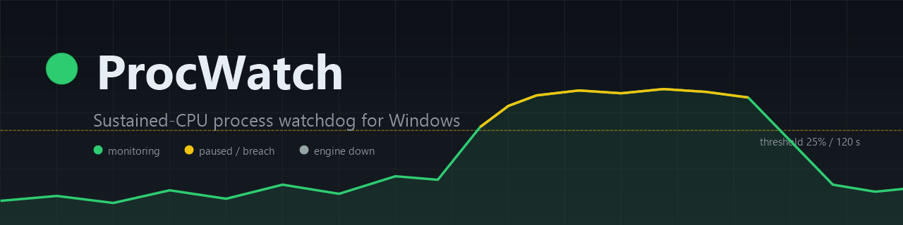

<p align="center">
  
</p>

# ProcWatch


A background watchdog that monitors **every process** (including system ones like
`explorer`) for **sustained** high CPU — a process must stay over a threshold for a
continuous duration before it fires, so transient spikes (e.g. a shell's startup
burst) are ignored. Breaches are surfaced through a **system-tray app** with
interactive notifications, and allowlisted shells (like `explorer`) are
auto-restarted.

Built after `explorer.exe` wedged into a blank-taskbar paint loop (3,122 CPU-seconds);
ProcWatch would have caught and auto-restarted it.

## Architecture

Three cooperating processes joined by file queues under `%ProgramData%\ProcWatch`.
The split exists because of Windows **session 0 isolation**: a SYSTEM service cannot
draw UI in your desktop session, so the privileged monitor and the UI live in
separate processes that talk through files.

| Component | Runs as | Host | Trigger | Job |
|-----------|---------|------|---------|-----|
| `Engine.ps1` | **SYSTEM** | pwsh 7 | at startup | sample CPU rates, detect sustained breaches, auto-restart allowlisted procs, execute queued commands, publish a heartbeat |
| `Tray.ps1` | **you** (interactive) | Windows PowerShell 5.1 `-STA` | at logon | system-tray icon + menu; raise interactive BurntToast toasts |
| `Handler.ps1` | you | pwsh 7 | `procwatch://` protocol | translate toast-button clicks into command files |

```text
%ProgramData%\ProcWatch\
  config.json            thresholds, allowlists, whitelist, paused (editable; engine reloads each loop)
  status.json            engine heartbeat   (engine writes, tray reads)
  procwatch.log          engine log (rotates at 5 MB)   tray.log / handler.log
  queue\notify\          engine -> tray     (breach / restarted)
  queue\commands\        tray/handler -> engine  (kill / whitelist / ignorepid / pause / resume)
  bin\  Engine.ps1  Tray.ps1  Handler.ps1  ProcWatch.psm1  Install/Uninstall/Status.ps1
```

### The system tray

The tray icon's colour reflects live engine state, read from the `status.json`
heartbeat (so the user-session tray can "see" the SYSTEM engine without any
privilege):

- 🟢 **green** — monitoring normally
- 🟡 **amber** — paused, or within 60 s of a breach
- ⚪ **grey** — engine down / heartbeat stale (older than 3 sampling intervals)

**Left-click** opens a small flyout with the **top 3 processes of the last
60 seconds by overall compute** (machine-wide %). A process that burned CPU in
the window but has since exited stays listed, muted grey and marked *ended* —
only the engine's rolling history can show that. The data comes from the
heartbeat, and keeps flowing even while monitoring is paused.

Right-click menu: **Pause/Resume monitoring**, **Edit config**, **Open logs
folder**, **Recent activity**, **About**, **Exit**. Double-click opens the logs
folder. Pause/Resume is performed by the SYSTEM engine — the tray only enqueues a
command (see below).

### Why a file queue and not a direct action from the tray

The tray runs as **you**; killing another session's or a SYSTEM-owned process, or
flipping engine state, would need elevation. Instead every privileged action
(kill / whitelist / pause / resume) is just a *request* the tray (or the protocol
handler) writes to `queue\commands`; the SYSTEM **engine** executes it. One
privileged code path, no UAC prompts, and the `protectNames` guard lives with the
code that does the killing.

### How CPU is measured

Per process: `ΔTotalProcessorTime / (Δwallclock × coreCount) × 100` = "% of whole
machine" (`cpuBasis: total`), or omit the core divisor for "% of one core"
(`cpuBasis: core`). A breach must persist `durationSeconds` continuously; a single
sub-threshold sample resets the timer. PID reuse is guarded by matching process
`StartTime`.

## config.json (defaults)

| Key | Default | Meaning |
|-----|---------|---------|
| `intervalSeconds` | 5 | sampling cadence |
| `thresholdPercent` | 25 | breach level |
| `durationSeconds` | 120 | must stay over threshold this long |
| `cpuBasis` | `total` | `total` = % of all cores, `core` = % of one |
| `graceSeconds` | 30 | ignore freshly-started PIDs (startup bursts) |
| `renotifyCooldownSeconds` | 600 | min gap between repeat alerts for a PID |
| `restartCooldownSeconds` | 300 | min gap between auto-restarts of a name |
| `maxRestartsPerHour` | 4 | restart circuit-breaker |
| `restartAllowlist` | `["explorer"]` | names auto-restarted on breach |
| `paused` | `false` | when true the engine samples but takes no action (tray Pause/Resume) |
| `ignoreNames` | `[]` | never alert (grows via the Whitelist button) |
| `protectNames` | system criticals | never killable, even by command |

Edits apply live — the engine reloads config every loop.

## Event log

Logged to the Windows **Application** log under source `ProcWatch`:

| ID | Meaning |
|----|---------|
| 1000 | sustained CPU breach detected |
| 1001 | auto-restart of an allowlisted process (or breaker suppression) |
| 1002 | process killed / kill refused (protected) by user request |
| 1003 | process name whitelisted |
| 1004 | engine started / stopped |
| 1005 | monitoring paused / resumed |
| 1010 | engine crash |

## Manage

```powershell
# status (read-only): tasks, heartbeat, config, recent events, log tail
pwsh -File C:\ProgramData\ProcWatch\bin\Status.ps1

# change a setting (engine picks it up within one interval)
$c = Get-Content C:\ProgramData\ProcWatch\config.json -Raw | ConvertFrom-Json
$c.thresholdPercent = 40; $c.durationSeconds = 180
$c | ConvertTo-Json -Depth 6 | Set-Content C:\ProgramData\ProcWatch\config.json

# pause / resume from the tray, or by hand:
'{ "type": "pause" }'  | Set-Content "C:\ProgramData\ProcWatch\queue\commands\$([guid]::NewGuid()).json"

# stop / start the service
Stop-ScheduledTask  -TaskName ProcWatch-Engine
Start-ScheduledTask -TaskName ProcWatch-Engine

# events
Get-WinEvent -FilterHashtable @{LogName='Application';ProviderName='ProcWatch'} -MaxEvents 20
```

## Install / Uninstall / Test (run elevated)

```powershell
pwsh -File <src>\bin\Install.ps1            # deploy + register tasks + start
pwsh -File <src>\bin\Uninstall.ps1          # remove tasks/protocol/source, keep logs
pwsh -File <src>\bin\Uninstall.ps1 -Purge   # also delete %ProgramData%\ProcWatch
pwsh -File <src>\test\Run-Tests.ps1         # 17 isolated tests (sandboxed ProgramData)
```

The installer deploys to `%ProgramData%\ProcWatch`, registers the
`procwatch://` protocol and the `ProcWatch` event source, installs BurntToast into
Windows PowerShell 5.1 (the tray's host; best-effort), and creates two scheduled
tasks: **ProcWatch-Engine** (SYSTEM, at startup) and **ProcWatch-Tray** (your
session, at logon).

See [CHANGELOG.md](CHANGELOG.md) for release history.

Source: `C:\Users\user\Code\ProcWatch` · GitHub: <https://github.com/pizzimenti/ProcWatch> · Deployed: `C:\ProgramData\ProcWatch`
